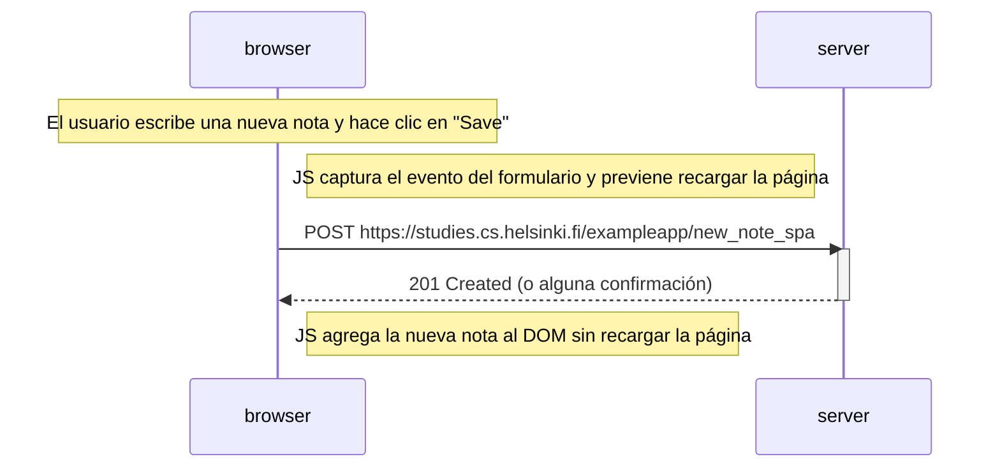

```mermaid
sequenceDiagram
    participant browser
    participant server

    Note over browser: El usuario escribe una nueva nota y hace clic en "Save"

    Note right of browser: JS captura el evento del formulario y previene recargar la página

    browser->>server: POST https://studies.cs.helsinki.fi/exampleapp/new_note_spa
    activate server
    server-->>browser: 201 Created (o alguna confirmación)
    deactivate server

    Note right of browser: JS agrega la nueva nota al DOM sin recargar la página
```