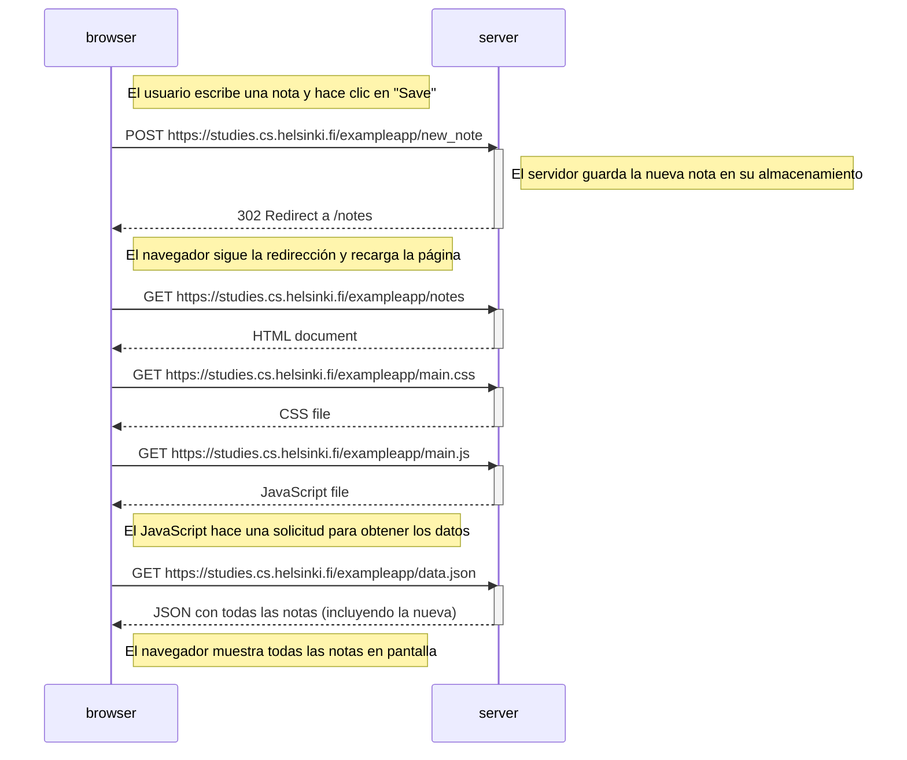

```mermaid
sequenceDiagram
    participant browser
    participant server

    Note right of browser: El usuario escribe una nota y hace clic en "Save"

    browser->>server: POST https://studies.cs.helsinki.fi/exampleapp/new_note
    activate server
    Note right of server: El servidor guarda la nueva nota en su almacenamiento
    server-->>browser: 302 Redirect a /notes
    deactivate server

    Note right of browser: El navegador sigue la redirección y recarga la página

    browser->>server: GET https://studies.cs.helsinki.fi/exampleapp/notes
    activate server
    server-->>browser: HTML document
    deactivate server

    browser->>server: GET https://studies.cs.helsinki.fi/exampleapp/main.css
    activate server
    server-->>browser: CSS file
    deactivate server

    browser->>server: GET https://studies.cs.helsinki.fi/exampleapp/main.js
    activate server
    server-->>browser: JavaScript file
    deactivate server

    Note right of browser: El JavaScript hace una solicitud para obtener los datos

    browser->>server: GET https://studies.cs.helsinki.fi/exampleapp/data.json
    activate server
    server-->>browser: JSON con todas las notas (incluyendo la nueva)
    deactivate server

    Note right of browser: El navegador muestra todas las notas en pantalla
```